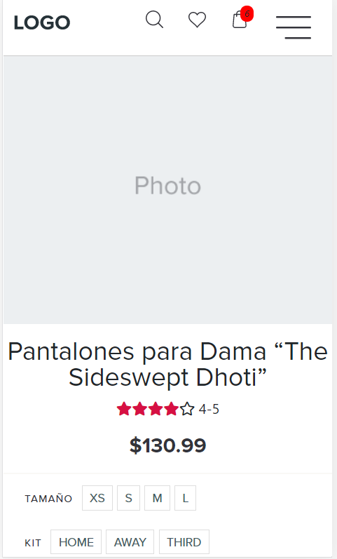

<h1> StoreApp </h1>

 
This project was bootstrapped with [Create React App](https://github.com/facebook/create-react-app).

## Development server

In the project directory, you can run:

- `npm install`
- `npm start`

## User and password test login

`kin@gmail.com`
`12345`

# Kevin Casasbuenas

Development test for Frontend Developer at OMNI.PRO

Introduction
With this test we want to evaluate your skills in the following areas:

Optimal use of Javascript and preferred libraries (VUEjs o Reactjs)
Optimal use of HTML
Optimal use of CSS/LESS
Medium use of Git
Programming best practices

During this test you can follow your personal development process. Please keep in mind that we want to get a product that balances quality and quantity.

If you're not capable of finishing this test in its entirety in the given timeframe we still should be able to appreciate your work and skills.

Think about this small application as a project that will be maintained and possibly extended in the future by other developers.

Development

Build a simple web interface according to the provided design: https://www.figma.com/file/SKzL1MltQ1lj4U0uq68mzPxB/Front-End-Developer-Test?node-id=0%3A1

A concise and documented Git history is expected. When the development has been finished a Merge Request should be created in order to notify the technical team that the test is ready to be evaluated. 

Bonus

Include and implement an external Javascript library to achieve the onclick animation.

Good luck!

